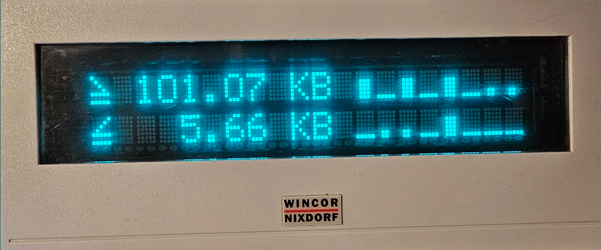

This is a quick hack for displaying the up/downstream of a fritzbox
and kind of load-bars. 

It needs the fritzconnection-library

pip install fritzconnection

and the VFD-WCN Library, see installation instructions:

https://github.com/stephanemouton/VFD-WCN

usage: fritz2.py --ip=<fritzbox> --user=<username> --pass=<passwd>

