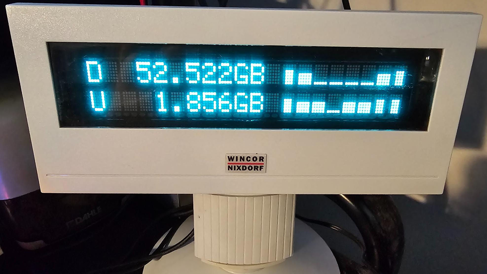

This is a quick hack for displaying the total up/downstream of a fritzbox
and kind of load-bars. 

It needs the fritzconnection-library

pip install fritzconnection

and the VFD-WCN Library, see installation instructions:

https://github.com/stephanemouton/VFD-WCN

Add credentials and let it run forever (values are persisted in file). With a new month, the values are reset. 
